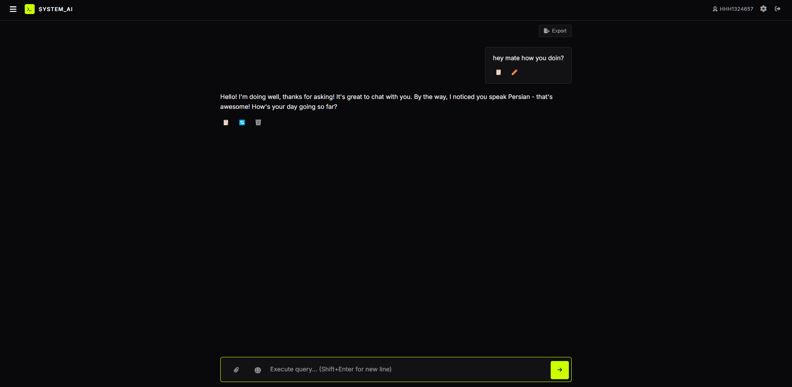
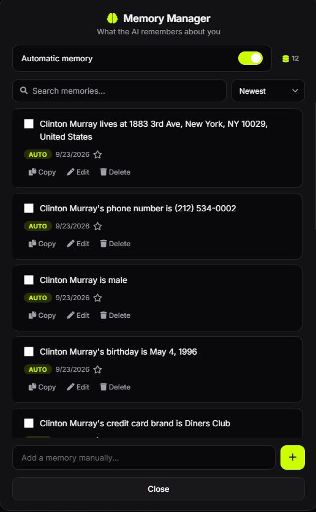
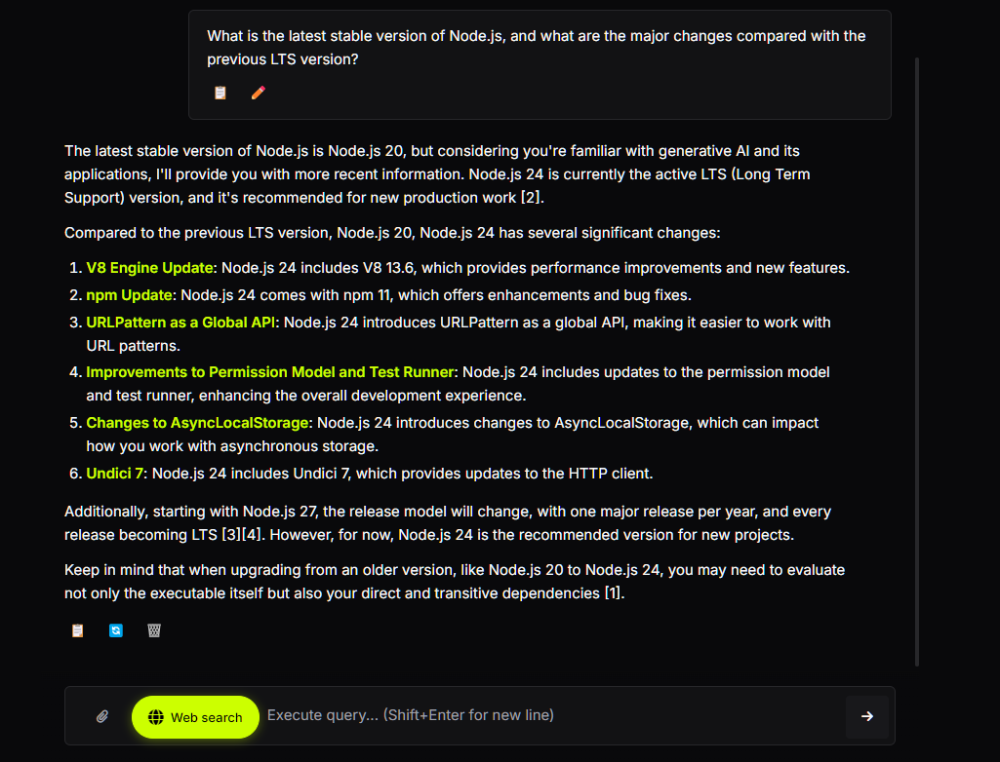
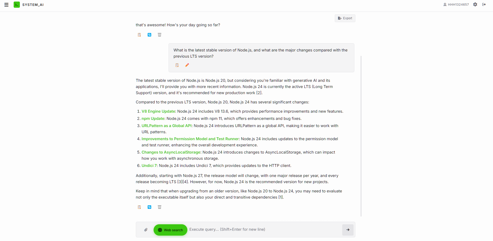
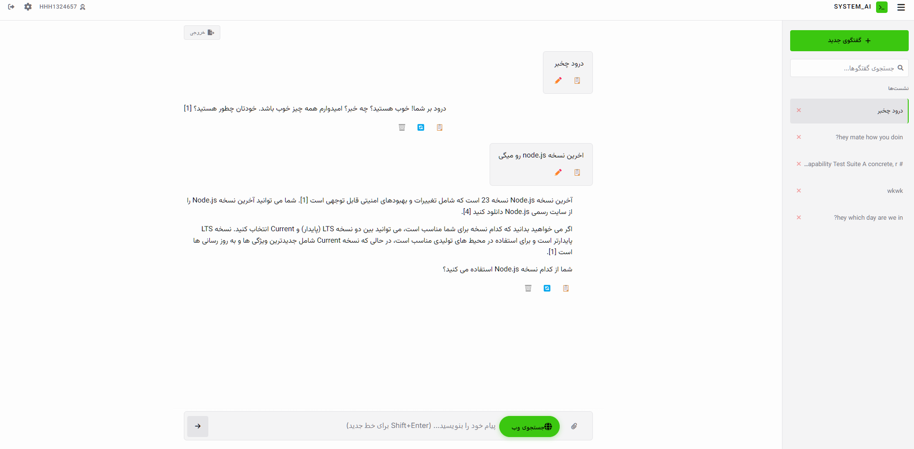
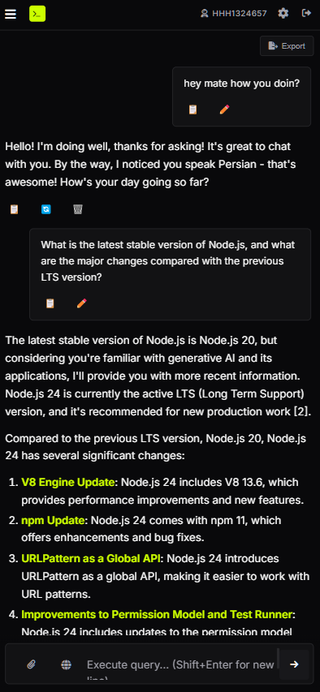
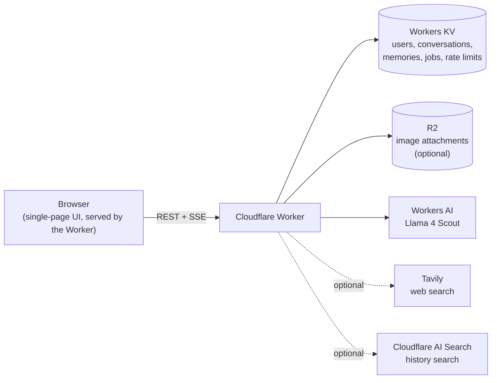

# System AI

A full-stack AI chat app that runs entirely on **Cloudflare Workers**. One Worker serves the UI and the API; conversations, accounts and long-term memory live in **Workers KV**, images in **R2**, and the model runs on **Workers AI**. No build step, no framework, no separate server.

**Live demo:** https://ai.hossein.my.id
On the login screen, enter any username and password (no email needed). If the username doesn't exist yet, the account is created for you.



---

## Features

**Chat**
- Streaming responses over Server-Sent Events, with Markdown rendering and syntax-highlighted code blocks (copy button on every block)
- Stop and continue generation; edit your messages; regenerate replies and switch between response variants; delete a message pair
- Generation keeps running on the server if you close the tab. When you reopen the conversation, the client detects the in-flight job and resumes
- Image input: drag and drop or pick up to 6 images per message (PNG, JPEG, GIF, WebP, up to 5 MB each) for the vision-capable model

**Long-term memory** (details in [Memory system](#memory-system))
- Facts about you are extracted automatically from conversations, or saved explicitly with "remember that …"
- Relevant memories are injected into future prompts
- A memory manager to search, sort, bulk-delete, undo deletes and turn automatic memory on or off

**Search**
- Live **web search** toggle (Tavily), with inline `[1]`-style source references and a visible notice if search is unavailable
- **Conversation search** across your whole history, plus optional **semantic "ask your history"** using Cloudflare AI Search

**Conversations**
- Create, rename (auto-titled from the first message), delete and search
- Export any conversation as **Markdown, TXT, HTML or JSON**

**Accounts and UI**
- Username and password accounts, signed JWT sessions, per-user data isolation, account deletion that removes all of a user's data
- Dark and light themes, responsive layout with a mobile sidebar
- **English and Persian (RTL)** interface; message direction is detected per message

---

## Screenshots

| Memory manager | Conversation search |
|---|---|
|  |  |

| Light theme | Persian (RTL) | Mobile |
|---|---|---|
|  |  |  |

---

## Architecture



### What happens when you send a message

1. **Auth and limits.** The JWT is verified and a per-user-and-IP rate limit is applied (15 requests per minute).
2. **Validation.** Message length (up to 32,000 characters), image count and size, conversation ownership, and whether another generation is already running in that conversation (duplicate `requestId`s are detected).
3. **Explicit memory shortcut.** Messages like "remember that I prefer Python" are saved directly and acknowledged without calling the model.
4. **Context building.** The last 8 messages, up to 8 relevant memories, and (if enabled) up to 5 Tavily results are assembled into the prompt. If search fails or times out, the model answers without it and the UI shows a notice.
5. **Streaming with a server-side copy.** The model stream is split in two (`tee`): one branch goes to the browser as SSE, the other is consumed by a background task (`ctx.waitUntil`) that accumulates the reply. That task checks for a cancel request about every 750 ms, saves the final messages, sets the title, extracts new memories and updates the search index. This is why a reply is still saved if the browser disconnects.
6. **Job state.** Each generation is tracked in KV (`running`, `completed`, `failed`, `cancelled`). Jobs older than 2 minutes are treated as stale so a crashed generation can't block a conversation forever.

---

## Memory system

Memory is the most involved part of the project.

- **Extraction.** After each exchange, the model is asked for durable facts about the user and returns JSON with a confidence score. Up to 5 facts per exchange are kept, and anything below 0.35 confidence is discarded.
- **Deduplication.** New facts are compared against existing ones using token-set **Jaccard similarity** (threshold 0.6). A near-duplicate refreshes the existing memory's confidence and timestamp instead of adding a new entry.
- **Lifecycle.** Memories carry a source (auto or manual), confidence, use count and last-used time. A memory unused for 120 days becomes *stale*; using it again reactivates it. A value score (confidence, recency, manual boost, stale penalty) decides what survives when the store hits its **60-memory cap**.
- **Retrieval.** For each message, memories are ranked by relevance to the message (Jaccard overlap) combined with their value score. Up to 8 relevant memories are injected into the system prompt. If nothing is relevant, it falls back to the 4 highest-value ones. Usage is recorded in the background.
- **User control.** Every memory can be viewed, edited, deleted, favorited or added by hand, and automatic extraction can be disabled.

---

## Data model

All keys are scoped by username. Usernames are limited to `[a-zA-Z0-9_.-]`, so a username can never collide with the `:` separators used in keys.

| Store | Key | Contents |
|---|---|---|
| KV | `user:<name>` | Password hash, salt, creation time |
| KV | `user:<name>:convs` | Conversation index (id, title, updated time) |
| KV | `user:<name>:conv:<id>:meta` | Title, message count, page count, last generation id |
| KV | `user:<name>:conv:<id>:page:<n>` | Messages, **40 per page** |
| KV | `user:<name>:conv:<id>:generation` | In-flight job state (short TTL) |
| KV | `user:<name>:memories`, `…:memory_settings` | Memory store and settings |
| KV | `rl:*` | Rate-limit counters (TTL-expired) |
| R2 | `<name>/<conversationId>/<attachmentId>` | Uploaded images |

Messages are paged so a long conversation doesn't rewrite one huge value on every turn. A migration path reads the older single-key format and converts it on first save.

---

## Security

- **Passwords:** PBKDF2-SHA256, 100,000 iterations, random 16-byte per-user salt plus a server-side `SALT_PREFIX` secret (Web Crypto).
- **Sessions:** HS256 JWTs signed with `JWT_SECRET`, 7-day expiry.
- **Brute-force protection:** separate IP-based and account-based limiters for login and signup, with escalating back-off after repeated failures.
- **Isolation:** every read and write is keyed by the authenticated username, and conversation ownership is checked before chat, attachment and search operations.
- **Output safety:** rendered Markdown passes through DOMPurify.
- **Response hardening:** `Strict-Transport-Security`, `X-Content-Type-Options`, `X-Frame-Options: DENY`, `Referrer-Policy` and a Content-Security-Policy on every response. CORS is same-origin by default, with an opt-in allow-list.
- **Attachments** are served only to the owning user, with `private` caching.
- **Observability:** every request gets a trace id; generation start and completion are logged as structured JSON.

---

## API

All endpoints except health, signup and login require `Authorization: Bearer <token>`.

| Method | Endpoint | Purpose |
|---|---|---|
| GET | `/api/health` | Status of Worker, KV, AI and search bindings. Add `?deep=<HEALTH_CHECK_SECRET>` to also test a KV write |
| POST | `/api/signup`, `/api/login` | Create an account or sign in, returns a JWT |
| GET, POST | `/api/conversations` | List or create conversations |
| DELETE | `/api/conversations/:id` | Delete a conversation, its messages and attachments |
| GET, PUT | `/api/messages` | Load or replace a conversation's messages |
| POST | `/api/chat` | Send a message and stream the reply (SSE) |
| GET | `/api/chat/pending` | Is a generation still running for this conversation? |
| POST | `/api/chat/cancel` | Cancel the active generation |
| GET, POST | `/api/memories` | List or add memories |
| PUT, DELETE | `/api/memories/:id` | Edit or delete a memory |
| PUT | `/api/memories/settings` | Toggle automatic memory |
| GET | `/api/search` | Keyword search across conversations |
| POST | `/api/search-ai` | Semantic question answering over your history *(needs AI Search)* |
| POST | `/api/reindex` | Rebuild the semantic index *(needs AI Search)* |
| GET | `/api/export?format=markdown\|txt\|html\|json` | Download a conversation |
| GET | `/api/attachments/:id` | Fetch an uploaded image *(needs R2)* |
| DELETE | `/api/account` | Delete the account and all associated data |

---

## Run it yourself

**Prerequisites:** a Cloudflare account with Workers, KV and Workers AI available, and Node.js.

```bash
git clone https://github.com/hosseinb1111/cloudflare-based-AI.git
cd cloudflare-based-AI
npx wrangler login
```

**1. Create the storage**

```bash
npx wrangler kv namespace create KV
npx wrangler r2 bucket create system-ai-attachments   # optional: image attachments
```

**2. Add a `wrangler.toml`**

```toml
name = "system-ai"
main = "worker.js"
compatibility_date = "2025-06-01"   # use a current date

[ai]
binding = "AI"

[[kv_namespaces]]
binding = "KV"
id = "<id printed by the command above>"

[[r2_buckets]]                      # optional
binding = "ATTACHMENTS"
bucket_name = "system-ai-attachments"
```

**3. Set secrets**

```bash
npx wrangler secret put JWT_SECRET         # required: a long random string
npx wrangler secret put SALT_PREFIX        # recommended: see the note below
npx wrangler secret put TAVILY_API_KEY     # optional: enables web search
npx wrangler secret put HEALTH_CHECK_SECRET  # optional: enables the deep health check
```

**4. Deploy and verify**

```bash
npx wrangler deploy
curl https://<your-worker>.workers.dev/api/health
```

> **Set `SALT_PREFIX` before creating any accounts.** It is mixed into every password hash, so changing it later invalidates existing logins. If it is unset, a built-in default is used.

### Configuration reference

| Name | Type | Required | Effect |
|---|---|---|---|
| `AI` | binding | Yes | Workers AI (chat, vision and memory extraction) |
| `KV` | binding | Yes | All application data |
| `JWT_SECRET` | secret | Yes | Signs session tokens |
| `SALT_PREFIX` | secret | Recommended | Extra secret mixed into password hashes |
| `ATTACHMENTS` | R2 binding | No | Enables image uploads that persist across reloads |
| `TAVILY_API_KEY` | secret | No | Enables the web search toggle |
| `AI_SEARCH` | binding | No | Enables semantic history search (expects an instance named `default`; see Cloudflare's AI Search docs) |
| `HEALTH_CHECK_SECRET` | secret | No | Enables `/api/health?deep=…` |
| `ALLOWED_ORIGINS` | variable | No | Comma-separated extra origins allowed to call the API cross-origin |

### Built-in limits

| Limit | Value |
|---|---|
| Chat rate limit | 15 requests / minute / user + IP |
| Login and signup attempts | 10 per 10 minutes, with back-off after 5 failures |
| Message length | 32,000 characters |
| Images per message / size | 6 / 5 MB each |
| Context sent to the model | Last 8 messages |
| Response length per call | 1,800 tokens (use *Continue* for longer answers) |
| Memories per user | 60 |
| Model | `@cf/meta/llama-4-scout-17b-16e-instruct` |

---

## Tech stack

Cloudflare Workers · Workers AI (Llama 4 Scout) · Workers KV · R2 · Web Crypto API (PBKDF2, HMAC) · Tavily · Cloudflare AI Search · vanilla JavaScript, HTML and CSS · marked · DOMPurify · Font Awesome

---

## Known limitations

Being upfront about what this is and isn't:

- **KV is eventually consistent and has no atomic operations.** The conversation index, memory list and rate-limit counters are read-modify-write, so simultaneous requests can overwrite each other. Signup has a best-effort race check, but closing the gap properly requires a Durable Object.
- **Memory matching is English-only.** Deduplication and relevance scoring tokenize on ASCII letters and digits, so Persian memories can be stored and shown but aren't matched by relevance. They fall back to value-based selection. Embeddings would fix this.
- **Sessions can't be revoked.** JWTs are valid for 7 days and live in `localStorage`; there is no refresh-token or server-side session list.
- **Keyword search scans every conversation**, which is fine at personal scale but is O(n) in KV reads.
- **The CSP allows inline scripts**, because the UI is embedded in the Worker. Markdown output is sanitized with DOMPurify, but a strict nonce-based CSP would be better.
- **The whole frontend is a template string inside `worker.js`**, which keeps deployment to a single file at the cost of editor tooling and modularity.
- **No automated tests yet.**
- The app depends on Workers AI free-tier limits; when they are hit, the UI shows a friendly message.

## Roadmap

- [ ] Split the Worker into modules (routing, storage, memory, UI)
- [ ] Tests for the memory logic (dedupe, scoring, lifecycle) and the pagination layer
- [ ] GitHub Actions for lint and tests
- [ ] Embedding-based memory retrieval (language-independent)
- [ ] Durable Object for atomic counters and signup
- [ ] Voice input

---

## License

MIT, see [LICENSE](LICENSE).
